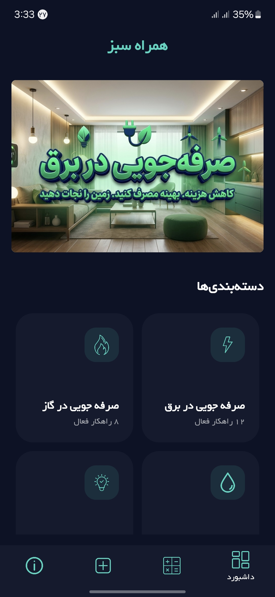
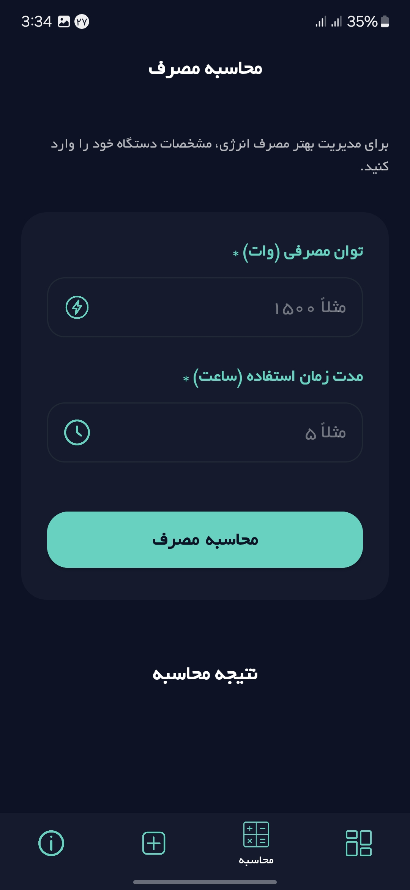
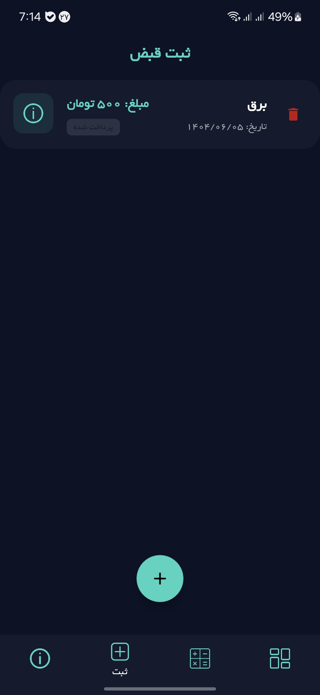
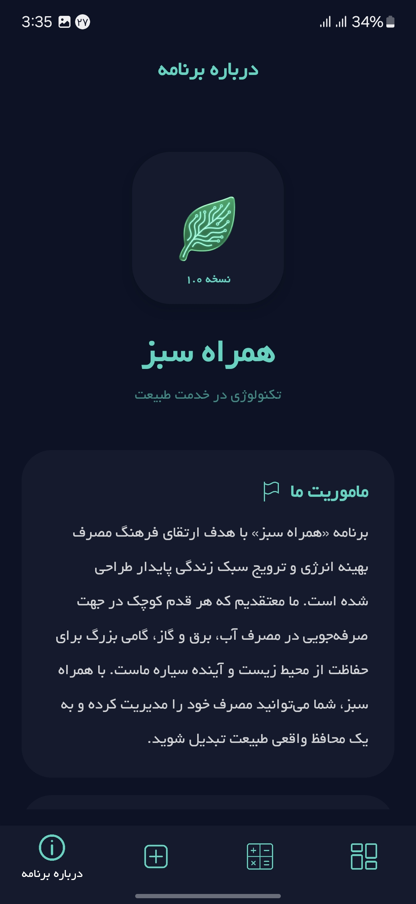
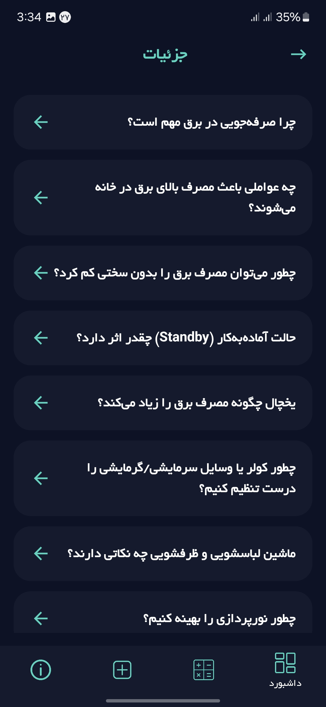

# Argan

Argan is an Android application developed with **Kotlin and XML**.

The project was created to practice Android application development and implement a simple, clean, and functional user interface.

## Technologies Used

* Kotlin
* XML
* Android Studio
* Android SDK
* Gradle
* Material Design

## Features

* Simple and user-friendly interface
* Dashboard screen
* Calculator functionality
* Registration screen
* Item management
* About section

## Screenshots

### Dashboard

### Calculator

### Registration

### About

### Item

## About the Project

Argan is a personal Android project developed using **Kotlin and XML**.

The main goal of this project was to gain practical experience with Android Studio, Kotlin, XML layouts, UI design, and Android application development.

## Project Status

This project is currently available on GitHub as a personal development and portfolio project.

## Author

**Reza Askari**

---

⭐ If you find this project useful, feel free to explore the source code.
